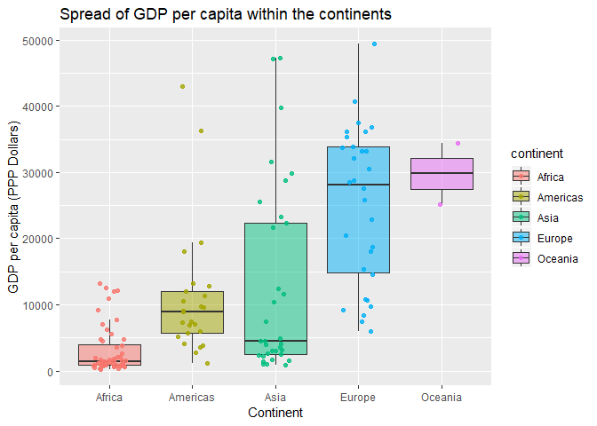
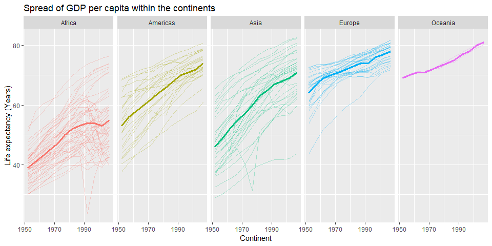
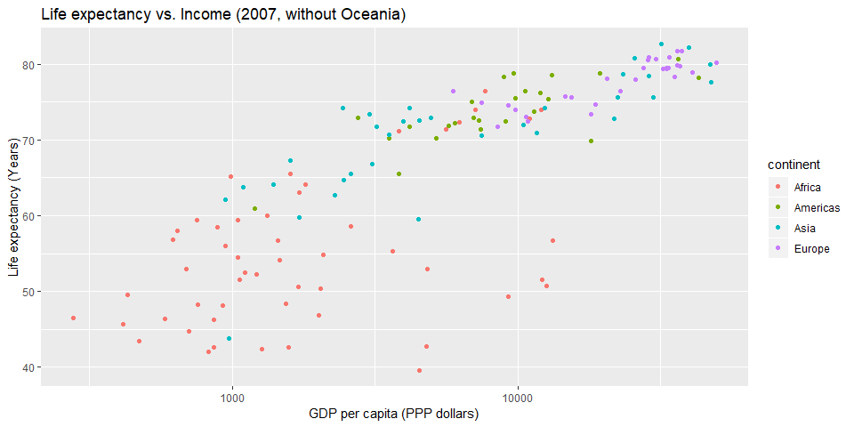
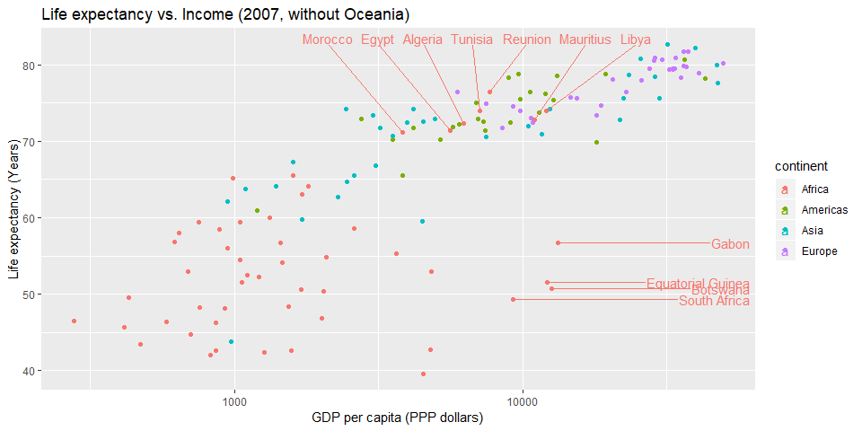

hw03-gapminder
================
@RetoSterchi
September 28, 2018

Homework 03: Use dplyr/ggplot2 to manipulate and explore data
=============================================================

First step: Load packages
-------------------------

``` r
require(gapminder)
require(ggplot2)
require(dplyr)
```

Exploration 1:
--------------

Get the maximum and minimum of GDP per capita for all continents.

``` r
## Lets get the maximum GDP per capita, looked up under
## https://stackoverflow.com/questions/40157648/find-max-per-group-with-dplyr-in-r?rq=1
gapminder %>% 
  filter(year == 2007) %>% # only 2007
  group_by(continent) %>% # group by continent
  arrange(gdpPercap) %>% # arrange within continent
  slice(which.max(gdpPercap)) # take max per group
```

    ## # A tibble: 5 x 6
    ## # Groups:   continent [5]
    ##   country       continent  year lifeExp       pop gdpPercap
    ##   <fct>         <fct>     <int>   <dbl>     <int>     <dbl>
    ## 1 Gabon         Africa     2007    56.7   1454867    13206.
    ## 2 United States Americas   2007    78.2 301139947    42952.
    ## 3 Kuwait        Asia       2007    77.6   2505559    47307.
    ## 4 Norway        Europe     2007    80.2   4627926    49357.
    ## 5 Australia     Oceania    2007    81.2  20434176    34435.

The same works with which.min()

``` r
gapminder %>% 
  filter(year == 2007) %>% # only 2007
  group_by(continent) %>% # group by continent
  arrange(gdpPercap) %>% # arrange within continent
  slice(which.min(gdpPercap)) # take min per group
```

    ## # A tibble: 5 x 6
    ## # Groups:   continent [5]
    ##   country          continent  year lifeExp      pop gdpPercap
    ##   <fct>            <fct>     <int>   <dbl>    <int>     <dbl>
    ## 1 Congo, Dem. Rep. Africa     2007    46.5 64606759      278.
    ## 2 Haiti            Americas   2007    60.9  8502814     1202.
    ## 3 Myanmar          Asia       2007    62.1 47761980      944 
    ## 4 Albania          Europe     2007    76.4  3600523     5937.
    ## 5 New Zealand      Oceania    2007    80.2  4115771    25185.

Or you can even just take the first row per group by specifiying slice(1)

``` r
gapminder %>% 
  filter(year == 2007) %>% # only 2007
  group_by(continent) %>% # group by continent
  arrange(gdpPercap) %>% # arrange within continent
  slice(1) # take first row per group
```

    ## # A tibble: 5 x 6
    ## # Groups:   continent [5]
    ##   country          continent  year lifeExp      pop gdpPercap
    ##   <fct>            <fct>     <int>   <dbl>    <int>     <dbl>
    ## 1 Congo, Dem. Rep. Africa     2007    46.5 64606759      278.
    ## 2 Haiti            Americas   2007    60.9  8502814     1202.
    ## 3 Myanmar          Asia       2007    62.1 47761980      944 
    ## 4 Albania          Europe     2007    76.4  3600523     5937.
    ## 5 New Zealand      Oceania    2007    80.2  4115771    25185.

Exploration 2:
--------------

Let's have a look at the spread of GDP per capita within the continents

``` r
gapminder %>% 
  filter(year == 2007) %>% 
  group_by(continent) %>% 
  summarize(gdpMean = round(mean(gdpPercap),0),
            gdpMin = round(min(gdpPercap),0),
            gdpMax = round(max(gdpPercap),0),
            gdpSD = round(sd(gdpPercap),0))
```

    ## # A tibble: 5 x 5
    ##   continent gdpMean gdpMin gdpMax gdpSD
    ##   <fct>       <dbl>  <dbl>  <dbl> <dbl>
    ## 1 Africa       3089    278  13206  3618
    ## 2 Americas    11003   1202  42952  9713
    ## 3 Asia        12473    944  47307 14155
    ## 4 Europe      25054   5937  49357 11800
    ## 5 Oceania     29810  25185  34435  6541

This table already tells us a little bit about the data and the differences across the different continents. Some of them seem to have a larger spread than others (Americas, Asia, Europe).

``` r
gapminder %>% 
  filter(year == 2007) %>% 
  group_by(continent) %>% 
  ggplot(aes(x = continent, y = gdpPercap, fill = continent)) +
  geom_boxplot(outlier.shape = NA, alpha = 0.5) +
  geom_jitter(width = 0.2, aes(colour = continent), alpha = 0.8) +
  ggtitle("Spread of GDP per capita within the continents") +
  xlab("Continent") +
  ylab("GDP per capita (PPP Dollars)")
```



The boxplots confirms what we saw in the table.

Exploration 3: How is life expectancy changing over time on different continents?
---------------------------------------------------------------------------------

Let's calculate the mean life expectancy per country first to get a sense of the data.

``` r
gapminder %>% 
  group_by(continent, year) %>% 
  summarize(lifeExpMean = round(mean(lifeExp),0))
```

    ## # A tibble: 60 x 3
    ## # Groups:   continent [?]
    ##    continent  year lifeExpMean
    ##    <fct>     <int>       <dbl>
    ##  1 Africa     1952          39
    ##  2 Africa     1957          41
    ##  3 Africa     1962          43
    ##  4 Africa     1967          45
    ##  5 Africa     1972          47
    ##  6 Africa     1977          50
    ##  7 Africa     1982          52
    ##  8 Africa     1987          53
    ##  9 Africa     1992          54
    ## 10 Africa     1997          54
    ## # ... with 50 more rows

Now let's plot that to see how it developed over time (1952 - 2007). I think a plot showing the mean life expectancy per continent together with the life expectancy curves per country in the background could work nicely. Let's see.

``` r
gapminder %>% 
  group_by(continent, year) %>% 
  summarize(lifeExpMean = round(mean(lifeExp),0)) %>% # calculate mean per continent
  ggplot(aes(x = year, y = lifeExpMean, colour = continent)) +
  geom_line(data = gapminder, 
            aes(x = year, y = lifeExp, group = country), 
            alpha = 0.3) + # thinner line for each country
  geom_line(size = 1.2) + # thicker line for mean
  facet_grid(.~ continent) + # make plot for each continent
  theme(legend.position="none") + # we dont need a legend
  scale_x_continuous(breaks=seq(1950, 2010, 20)) + # specify ticks on x-axis
  ggtitle("Spread of GDP per capita within the continents") +
  xlab("Continent") +
  ylab("Life expectancy (Years)")
```



The difference per continent is tremendous! While Europe "started" with an average life expectancy of approximately 65 years in the 1950s, Africa and Asia's mean life expectancy was at approximately 40 to 45 years back then. Asia has caught up, though and its curve shows an impressive steepness.

Note to myself with regards to the graph: Think about the order of how the different layers get plotted (e.g., plot thin lines for the background first and then add the thicker lines in the foreground). Also, facet\_grid() arranges the individual plots in one line, facet\_wrap() just wraps the plots around the line (customizable though how many plots). In our case, it was more useul to arrange them all on the same line to make comparisons easier.

Exploration 4: Can we find a good story with life expectancy in relation to income?
-----------------------------------------------------------------------------------

Let's see if we can do something with the life expectancy data and the income. Maybe let's start with a table where we summarize life expectancy (mean across countries) against the GPD per capita of individual countries (again, the mean across countries) for the most recent year in the dataset. For the sake of playing with different measures with can also think about including the weighted means (with regards to population). This might tell us something about disparities within a continent.

``` r
gapminder %>% 
  filter(year == 2007) %>% 
  group_by(continent) %>% 
  summarize(lifeExpMean = round(mean(lifeExp), 1),
            gdpPercapMean = round(mean(gdpPercap),0),
            lifeExpMeanW = round(weighted.mean(lifeExp,pop),1),
            gdpPercapMeanW = round(weighted.mean(gdpPercap,pop),0))
```

    ## # A tibble: 5 x 5
    ##   continent lifeExpMean gdpPercapMean lifeExpMeanW gdpPercapMeanW
    ##   <fct>           <dbl>         <dbl>        <dbl>          <dbl>
    ## 1 Africa           54.8          3089         54.6           2561
    ## 2 Americas         73.6         11003         75.4          21603
    ## 3 Asia             70.7         12473         69.4           5432
    ## 4 Europe           77.6         25054         77.9          25244
    ## 5 Oceania          80.7         29810         81.1          32885

``` r
gapminder %>%
  filter(year == 2007 & continent != "Oceania") %>% # exclude Oceania, since only two countries
  ggplot(aes(x = gdpPercap, y = lifeExp, group = country, colour = continent)) +
  geom_point() +
  xlab("GDP per capita (PPP dollars)") +
  ylab("Life expectancy (Years)") +
  ggtitle("Life expectancy vs. Income (2007, without Oceania)") +
  scale_fill_discrete(name="Continent") +
  scale_x_log10() # use a log scale
```



Looks like there is a relationship between these two parameters what makes sense if we consider what potentialy influences life expectancy (quality of sanitary facilities, child fatality, access to medical services etc.)

We can also see that there are seven countries in Africa where the life expectancy is above 70 years and comparable to many countries in Asia or some of Europe. Let's identify those seven countries with a query.

``` r
gapminder %>%
  filter(year == 2007 & continent == "Africa" & lifeExp > 70)
```

    ## # A tibble: 7 x 6
    ##   country   continent  year lifeExp      pop gdpPercap
    ##   <fct>     <fct>     <int>   <dbl>    <int>     <dbl>
    ## 1 Algeria   Africa     2007    72.3 33333216     6223.
    ## 2 Egypt     Africa     2007    71.3 80264543     5581.
    ## 3 Libya     Africa     2007    74.0  6036914    12057.
    ## 4 Mauritius Africa     2007    72.8  1250882    10957.
    ## 5 Morocco   Africa     2007    71.2 33757175     3820.
    ## 6 Reunion   Africa     2007    76.4   798094     7670.
    ## 7 Tunisia   Africa     2007    73.9 10276158     7093.

Many of these countries seem to be former French colonies (<https://en.wikipedia.org/wiki/List_of_French_possessions_and_colonies>). Reunion actually is an overseas department of France. Is there potentially a historic component to this that the former French colonies are better of due to their ties to France?

What about African countries that have a fairly high GDP but still a lower life expectancy than our seven countries?

``` r
gapminder %>%
  filter(year == 2007 & continent == "Africa" & lifeExp < 70 & gdpPercap > 9000)
```

    ## # A tibble: 4 x 6
    ##   country           continent  year lifeExp      pop gdpPercap
    ##   <fct>             <fct>     <int>   <dbl>    <int>     <dbl>
    ## 1 Botswana          Africa     2007    50.7  1639131    12570.
    ## 2 Equatorial Guinea Africa     2007    51.6   551201    12154.
    ## 3 Gabon             Africa     2007    56.7  1454867    13206.
    ## 4 South Africa      Africa     2007    49.3 43997828     9270.

Let's label these countries on the top of the graph with the help of the ggrepel package where we can specify the location of the text labels.

``` r
require(ggrepel)
```

    ## Loading required package: ggrepel

    ## Warning: package 'ggrepel' was built under R version 3.4.4

``` r
  Query1 <- c("Reunion", "Libya", "Tunisia", "Mauritius", "Algeria", "Egypt", "Morocco")
  Query2 <- c("Botswana", "Equatorial Guinea", "Gabon", "South Africa")
  
  gapminder %>%
    filter(year == 2007 & continent != "Oceania") %>% # exclude Oceania, since only two countries
    ggplot(aes(x = gdpPercap, y = lifeExp, group = country, colour = continent, label = country)) +
    geom_point() +
    geom_text_repel(data = subset(gapminder, year == 2007 & country %in% Query1),
                    nudge_y = 90 - subset(gapminder, year == 2007 & 
                                            country %in% Query1)$lifeExp) + # this alignes the labels on the top
      geom_text_repel(data = subset(gapminder, year == 2007 & country %in% Query2),
                    nudge_x = 120 - subset(gapminder, year == 2007 & 
                                            country %in% Query2)$lifeExp) + # this alignes the labels on the right
    xlab("GDP per capita (PPP dollars)") +
    ylab("Life expectancy (Years)") +
    ggtitle("Life expectancy vs. Income (2007, without Oceania)") +
    scale_fill_discrete(name="Continent") +
    scale_x_log10() # use a log scale
```



Two of these countries are again former French colonies. Botswana is a former British colony and South Africa was both a Dutch and later a British colony. So there only just a little support for the theory that the former French colonies might be better of. Could it be because they are geographically closer to Europe? Most of the top seven African countries are in the Mediterranian region... I guess we would need additional data to support more of this exploration.

Let's explore some other ways to make pleasant tables
-----------------------------------------------------

Let's check out the 'pander' package. This seems to be a nice way of showing tables in a report. Queries can directly by passed on to the pander() function and are displayed in a pleasing way instead of the tibble output format.

Check out this link for more details on how to customize the output: <http://rapporter.github.io/pander/>

``` r
# install.packages('pander')
require(pander)

## This makes nice table for a report
pander(gapminder %>%
  filter(year == 2007 & continent == "Africa" & lifeExp > 70))
```

<table style="width:88%;">
<colgroup>
<col width="16%" />
<col width="16%" />
<col width="9%" />
<col width="13%" />
<col width="15%" />
<col width="15%" />
</colgroup>
<thead>
<tr class="header">
<th align="center">country</th>
<th align="center">continent</th>
<th align="center">year</th>
<th align="center">lifeExp</th>
<th align="center">pop</th>
<th align="center">gdpPercap</th>
</tr>
</thead>
<tbody>
<tr class="odd">
<td align="center">Algeria</td>
<td align="center">Africa</td>
<td align="center">2007</td>
<td align="center">72.3</td>
<td align="center">33333216</td>
<td align="center">6223</td>
</tr>
<tr class="even">
<td align="center">Egypt</td>
<td align="center">Africa</td>
<td align="center">2007</td>
<td align="center">71.34</td>
<td align="center">80264543</td>
<td align="center">5581</td>
</tr>
<tr class="odd">
<td align="center">Libya</td>
<td align="center">Africa</td>
<td align="center">2007</td>
<td align="center">73.95</td>
<td align="center">6036914</td>
<td align="center">12057</td>
</tr>
<tr class="even">
<td align="center">Mauritius</td>
<td align="center">Africa</td>
<td align="center">2007</td>
<td align="center">72.8</td>
<td align="center">1250882</td>
<td align="center">10957</td>
</tr>
<tr class="odd">
<td align="center">Morocco</td>
<td align="center">Africa</td>
<td align="center">2007</td>
<td align="center">71.16</td>
<td align="center">33757175</td>
<td align="center">3820</td>
</tr>
<tr class="even">
<td align="center">Reunion</td>
<td align="center">Africa</td>
<td align="center">2007</td>
<td align="center">76.44</td>
<td align="center">798094</td>
<td align="center">7670</td>
</tr>
<tr class="odd">
<td align="center">Tunisia</td>
<td align="center">Africa</td>
<td align="center">2007</td>
<td align="center">73.92</td>
<td align="center">10276158</td>
<td align="center">7093</td>
</tr>
</tbody>
</table>

``` r
## This makes a simple table in a console style output
pandoc.table(gapminder %>%
  filter(year == 2007 & continent == "Africa" & lifeExp > 70),
  style = "simple")
```

    ## 
    ## 
    ##   country    continent   year   lifeExp     pop      gdpPercap 
    ## ----------- ----------- ------ --------- ---------- -----------
    ##   Algeria     Africa     2007    72.3     33333216     6223    
    ##    Egypt      Africa     2007    71.34    80264543     5581    
    ##    Libya      Africa     2007    73.95    6036914      12057   
    ##  Mauritius    Africa     2007    72.8     1250882      10957   
    ##   Morocco     Africa     2007    71.16    33757175     3820    
    ##   Reunion     Africa     2007    76.44     798094      7670    
    ##   Tunisia     Africa     2007    73.92    10276158     7093

``` r
## We can also add captions to such tables and specify the alignment
pander(gapminder %>%
  filter(year == 2007 & continent == "Africa" & lifeExp > 70),
  caption = "Hello, this is a table caption!",
  justify = c('left', 'center', 'center', 'center', 'right', 'right'))
```

<table style="width:88%;">
<caption>Hello, this is a table caption!</caption>
<colgroup>
<col width="16%" />
<col width="16%" />
<col width="9%" />
<col width="13%" />
<col width="15%" />
<col width="15%" />
</colgroup>
<thead>
<tr class="header">
<th align="left">country</th>
<th align="center">continent</th>
<th align="center">year</th>
<th align="center">lifeExp</th>
<th align="right">pop</th>
<th align="right">gdpPercap</th>
</tr>
</thead>
<tbody>
<tr class="odd">
<td align="left">Algeria</td>
<td align="center">Africa</td>
<td align="center">2007</td>
<td align="center">72.3</td>
<td align="right">33333216</td>
<td align="right">6223</td>
</tr>
<tr class="even">
<td align="left">Egypt</td>
<td align="center">Africa</td>
<td align="center">2007</td>
<td align="center">71.34</td>
<td align="right">80264543</td>
<td align="right">5581</td>
</tr>
<tr class="odd">
<td align="left">Libya</td>
<td align="center">Africa</td>
<td align="center">2007</td>
<td align="center">73.95</td>
<td align="right">6036914</td>
<td align="right">12057</td>
</tr>
<tr class="even">
<td align="left">Mauritius</td>
<td align="center">Africa</td>
<td align="center">2007</td>
<td align="center">72.8</td>
<td align="right">1250882</td>
<td align="right">10957</td>
</tr>
<tr class="odd">
<td align="left">Morocco</td>
<td align="center">Africa</td>
<td align="center">2007</td>
<td align="center">71.16</td>
<td align="right">33757175</td>
<td align="right">3820</td>
</tr>
<tr class="even">
<td align="left">Reunion</td>
<td align="center">Africa</td>
<td align="center">2007</td>
<td align="center">76.44</td>
<td align="right">798094</td>
<td align="right">7670</td>
</tr>
<tr class="odd">
<td align="left">Tunisia</td>
<td align="center">Africa</td>
<td align="center">2007</td>
<td align="center">73.92</td>
<td align="right">10276158</td>
<td align="right">7093</td>
</tr>
</tbody>
</table>
